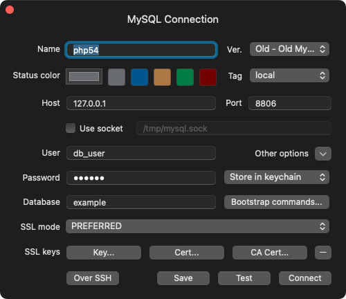

Docker image for old PHP & MySQL
---------------------------------

*Local dev environment using php 5.4 and mysql 5.5*

##### TablePlus settings




##### Notes

> add to /etc/hosts

```
127.0.0.1 sample.local
```

> make certificate

```
mkcert -cert-file sample.local.crt -key-file sample.local.key sample.local localhost 127.0.0.1 ::1
```
